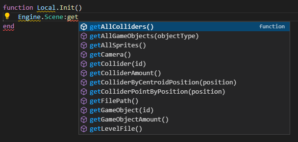
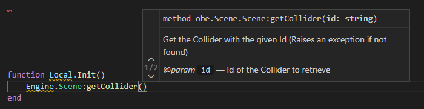

# ÖbEngine VS Code Extension

Develop games for ÖbEngine using VS Code as your editor !

## Features

### Code completion

#### Listing available functions / methods

#### Using documentation and argument list

## Requirements

This package uses [sumneko's Lua extension](https://marketplace.visualstudio.com/items?itemName=sumneko.lua) as a language server.

## Extension Settings

This extension contributes the following settings:

* `Lua.workspace.library`: List of directories used by [sumneko's Lua extension](https://marketplace.visualstudio.com/items?itemName=sumneko.lua) to load type hints

## Known Issues

If you encounter any issues with the extension itself [please report it here](https://github.com/ObEngine/ObEngine-VSCode/issues)

If you encounter any issues with the type hints (outdated typehints for example) [please report it here](https://github.com/ObEngine/ObEngine/issues)

## Release Notes

### 0.0.1

Initial release of ÖbEngine VS Code Extension
